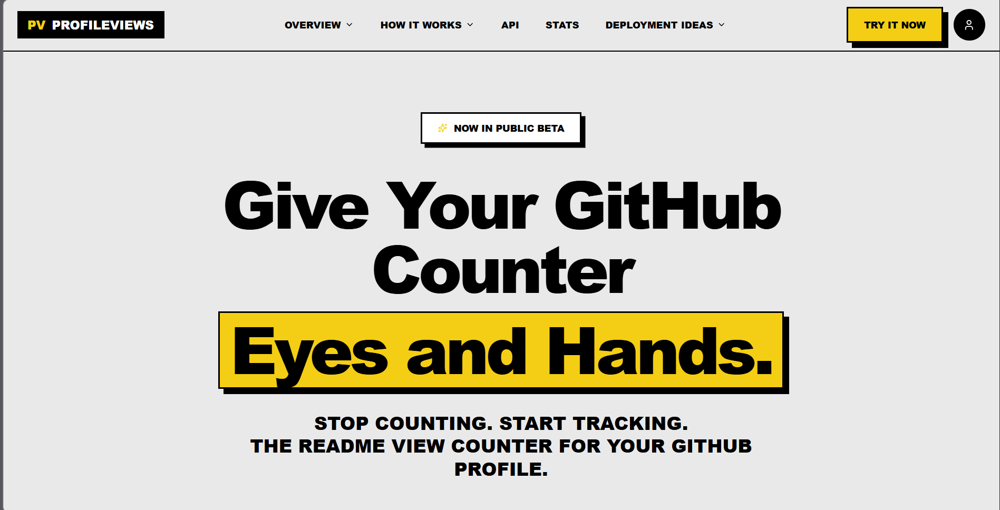

# GitHub Profile Views Counter

A self-hosted GitHub profile views counter with a **RetroUI / Selanet-inspired frontend** and a backend API that returns both **JSON** and an **SVG badge** for your GitHub README.

## What this project does

This project lets you run your own profile views counter instead of using a third-party badge service.

It includes:

- a frontend dashboard to preview your counter
- a backend API to track profile views
- an SVG badge endpoint for your GitHub README
- a MySQL database for storing counts
- a RetroUI-inspired design with bold borders, yellow accents, and offset shadows

## How it works

When someone opens your GitHub README, GitHub loads the image from your badge URL.

That badge URL points to your backend, for example:

```md

```

When that endpoint is requested:

1. the backend receives the request
2. it checks the GitHub username in the URL
3. it identifies the visitor using IP address and user-agent hash
4. it checks whether that visitor was already counted recently
5. if not, it increments the view count
6. it returns an SVG badge showing the latest total views

The frontend dashboard uses the API to display:

- total views
- status
- username
- badge URL
- README markdown

## Project structure

```bash
project-root/
├── backend/
│   ├── server.js
│   ├── package.json
│   └── .env
├── frontend/
│   ├── src/
│   │   ├── App.tsx
│   │   └── components/
│   │       ├── ProfileViews.tsx
│   │       └── ProfileViews.css
│   ├── package.json
│   └── vite.config.ts
└── README.md
```

## Backend endpoints

### `GET /api/views/:username`

Counts a view and returns JSON.

Example response:

```json
{
  "username": "your-github-username",
  "views": 1284,
  "updatedAt": "2026-03-13T01:00:00.000Z",
  "counted": true
}
```

### `GET /api/badge/:username`

Counts a view and returns an SVG badge.

This is the endpoint you use in your GitHub README.

### `GET /api/badge-preview/:username`

Returns the SVG badge preview without increasing the count.

### `GET /api/profile/:username`

Returns the current count without incrementing the views.

### `GET /api/stats/top`

Returns the top viewed profiles.

### `GET /api/health`

Health check endpoint.

## Frontend features

The frontend dashboard allows you to:

- enter a GitHub username
- preview the live counter
- copy the badge URL
- copy the README markdown
- test your API endpoint
- switch between badge themes
- view a RetroUI styled dashboard

## Installation

## 1. Backend setup

Install backend dependencies:

```bash
npm install express cors mysql2 dotenv
```

Run the backend:

```bash
node server.js
```

Environment variables:

```env
PORT=3001
BASE_URL=https://your-domain.com
TRUST_PROXY=true
COOLDOWN_HOURS=24

MYSQLHOST=your-mysql-host
MYSQLPORT=3306
MYSQLUSER=your-mysql-user
MYSQLPASSWORD=your-mysql-password
MYSQLDATABASE=your-mysql-database
```

### What the backend environment variables mean

- `PORT`: server port
- `BASE_URL`: public backend URL
- `TRUST_PROXY`: set to `true` when deployed behind Railway, Render, or another proxy
- `COOLDOWN_HOURS`: prevents the same visitor from being counted again too quickly
- `MYSQLHOST`: MySQL server host
- `MYSQLPORT`: MySQL server port
- `MYSQLUSER`: MySQL username
- `MYSQLPASSWORD`: MySQL password
- `MYSQLDATABASE`: MySQL database name

## 2. Frontend setup

Install frontend dependencies:

```bash
npm install
npm install lucide-react
```

Run the frontend:

```bash
npm run dev
```

## 3. Connect the frontend to the backend

In `ProfileViews.tsx`, change this:

```ts
const DEMO_BASE_URL = "https://your-domain.com";
```

To your real backend URL, for example:

```ts
const DEMO_BASE_URL = "http://localhost:3001";
```

Or in production:

```ts
const DEMO_BASE_URL = "https://your-backend-domain.com";
```

## Add the badge to your GitHub README

Use this markdown:

```md

```

Example:

```md

```

If your project supports theme selection, you can also use:

```md

```

or

```md

```

## Anti-spam protection

The backend includes basic anti-refresh spam protection.

It uses:

- IP address
- user-agent
- cooldown timer

This means repeated refreshes from the same visitor within the cooldown window will not always increase the count.

## Deployment ideas

### Frontend

You can deploy the frontend on:

- Vercel
- Netlify

### Backend

You can deploy the backend on:

- Railway
- Render
- Vercel Functions
- Cloudflare Workers

## Notes

- MySQL is used as the main database for storing profile views
- this is better suited for deployment than a local SQLite file
- badge requests may be cached by some services, so real-world counting is never perfectly exact
- GitHub image rendering behavior can affect how often the badge endpoint is called

## Customization ideas

You can improve this project by adding:

- dark mode
- multiple badge themes
- per-day analytics
- charts for view history
- admin dashboard
- username validation against the GitHub API
- PostgreSQL support
- Redis-based rate limiting

## Example workflow

1. deploy the backend
2. deploy the frontend
3. update `DEMO_BASE_URL` in the frontend
4. test `/api/views/:username`
5. test `/api/badge/:username`
6. add the badge markdown to your GitHub README
7. push your README changes to GitHub
8. watch the counter update over time

## Troubleshooting

### The badge does not load

Check that:

- your backend is deployed and public
- your `/api/badge/:username` endpoint works in the browser
- your domain uses HTTPS in production

### The counter does not increase

Check that:

- the username is valid
- your cooldown is not too long
- your MySQL database is connected and writable
- the request is reaching the backend

### The frontend shows fallback data

That usually means:

- the backend URL is wrong
- the backend is not running
- CORS is blocking the request

## License

You can use this project as a personal starter template and customize it for your own GitHub profile tools.
